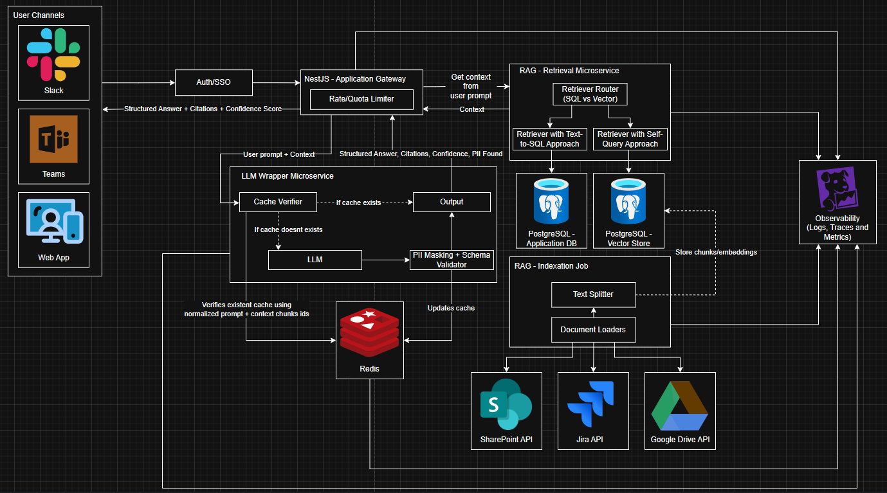

# AI Powered Knowledge Assistant

## Initial Considerations
- This repository is an architecture of an _AI powered knowledge assistant_ app, made for a technical interview.
- The architecture was split into three phases (T-shirt sizing) aiming for better visibility of each stage of maturity and easier difference recognition between them, being each one:
    - Small: Just enough to prove the app use-case, this version does not include many of the important aspects of a production application (such as observability, security and scalability).
    - Medium: Improved version of the small one; featuring a separated microservice to handle the LLM, Redis for caching, enhanced observability with Datadog and PII masking for improved security. Ideal for validating the app with more users while maintaining a reduced cost.
    - Large: Improved version of the medium one; featuring a planner/task decomposer for RAG retrieval, a reranker for better RAG accuracy, a self-hosted SML (Small Language Model) for fallback from external LLM unavailabilities and more. Ideal for enterprise usage.
- Some of the components are purposely hidden from the architecture, such as Kubernetes, for better visibility. They are mentioned in more detail in sections below.

## Assumptions

- **Usage Estimation**: About 2000 users per day with a peak of 300 concurrent queries on databases.
- **User Channels**: Since the application should be available through an API, any external tool which allows API integration should work. In the architecture, Slack, Teams and a custom web app were considered.
- **Data Sources**: 
    - Structured: Company application database (clients data), for prompts like "How many clients which are in Premium contract do we have?" or "What clients represent at least 5% of our income last year?".
    - Unstructured: Jira API (tickets and boards), Google Drive API (documents and compliances) and Sharepoint API (internal company statements and policies), for prompts like "What tickets already have their SLA outdated?", "Which developer is responsible for developing feature Y?","When is the end of our contract with client X?" or "What are our policies about regional holidays?".
- **Data Sensitiveness and Compliance**: The major part of data sources contains sensitive information, such as names, contract values, internal information, and so on. To handle this situation:
    - LLMs should always mention information source.
    - PII should be masked.
    - System prompt and user prompt should be handled separately to prevent _jailbreaks_ and _prompt injections_, so, any request that violates the user access should be denied.
    - Direct connections with databases should be done with credentials that have access just to read the data.
    - All requests to any of the mentioned microservices should use a modern token-based solution (such as OAuth 2.0 or JWT).
- **Security**: 
    - Users originated from Slack or Teams are already authenticated and trusted by the company. 
    - Users originated from the _web app_ have logged in and also are trusted by the company before use of this AI app.  
    - Any secrets and/or sensitive information used for this app run should be stored in a vault and this should only be accessible through the CD pipeline.
- **Infrastructure**: 
    - A pre-existent contract with each one of the external APIs, featuring enterprise plans and a generous usage quota.
    - A pre-existent Kubernetes cluster for application deploy.
    - A pre-existent PostgreSQL database featuring company clients data.
    - A pre-existent Datadog workspace.
    - A new API gateway service to handle rate limits.
    - A new Redis instance for the application.
    - A new database for vectors storage.
- **Audit**: The microservices and their components will generate access logs, external integrations logs, PII logs and token usage logs for future audit. This same information will be used to generate cost and user behavior metrics in the most mature version of this architecture.
- **Costs**: The LLM of choice should have a previously configured budget in the external provider, this budget should also be managed by the application through responses and HTTP status from the external provider, and when empty, the application should use the fallback method or respond users with _quota reached_ message.

## Version 1 - Small

[Access this diagram here (Draw.io format)](./diagrams/small.drawio)

### Remarks
As mentioned before, this version contains the minimum to validate the idea and will be improved in the next versions explained above.

### Key Points
At left we have the three sources where users can access this application, which were mentioned before. All of them need to pass through the "Auth/SSO" provider in order to guarantee that this user is allowed to access the application.

In the middle we have our "Application Gateway", responsible for centralizing the request, generating basic telemetry and providing context for our LLM. In this case, the application gateway itself integrates directly with our external LLM provider API, where the LLM box is separated just to improve the visibility. This was designed like that to simplify the application, since applying separation of concerns concept would require a new microservice, leading to more time and costs applied to validate the idea. 

At right, we have two containers, the first one, "RAG - Indexation Job", which is a background job responsible for indexing external unstructured data sources. Once information is fetched by it, the document loaders and text splitters create embeddings of the documents and their metadata to be saved on our _vector store_. And we have the second container, the "RAG - Retrieval Microservice", responsible for providing RAGs based on user prompts. There we have a Request Router, a component created to understand the intent of user. Using Rule-Based routing it decides where to fetch the information, at the company database using _Text-to-SQL_ approach (where natural language is transformed to SQL statements) or at the vector database using _Self-Query_ approach (where natural language is transformed to queries with metadata filters).

Finally at the top, we have a basic telemetry happening, storing the error logs and tokens usage metrics on a console/text-file, this was also done on purpose, aiming simplicity and low-cost at this beginning.

### Trade-offs
- Easier and quicker development allows idea validation before proceeding to a higher investment.
- Doing Rule-Based routing with _regex_ and _keywords_ is a simpler way to decide which retriever to use, leading to reduced infrastructure usage and providing faster development. In parallel, this can also cause misleading context and consequently, lower accuracy in the LLM answer.
- By not having any kind of _guardrail_, we can expose sensitive information.
- By not having a wrapper for the LLM, the Application Gateway component can possibly deal with unexpected/unhandled errors.
- Some types of text splitting techniques may be more useful when handling different types of documents (JSON, PDF, Markdown, plain text) in the indexation pipeline, but for more straightforward development, we are considering in this version just the _character-length based_ technique, independent of the document format.

## Version 2 - Medium

[Access this diagram here (Draw.io format)](./diagrams/medium.drawio)

### Remarks
- NestJS logo was removed to improve readability but the concept still the same, except the points mentioned above.

### Key Points
Now we have some new components and features in this version. First of them is the "LLM Wrapper Microservice" at the center, responsible for wrapping the LLM API calls, which is now no longer a piece of the "Application Gateway". Inside this wrapper we started to handle caching, using the normalized prompt from the user plus the chunks identifiers to store common questions answers. Beyond that, we also start to mask PII (which can be achieved with Microsoft Presidio) and enforce structured JSON responses from the LLM (which can be achieved with Pydantic, for example). After all, we start to make available structured results, featuring not just the answer but also citations, confidence score and PII flag (which enables a better understanding of user interests/behavior). Remembering, both of the mentioned tools are open-source and free for commercial use.  

In parallel we started to control user quotas based on their roles and also rate limiting in our API Gateway, which improve scalability, security, governability and enables a better usage control by segregating user types (through RBAC, by example).

Finally, we have Datadog at right, collecting logs and traces from all of our microservices and jobs. Also collecting metrics from our resources, like databases and Redis.

### Trade-offs
- Having a new microservice for wrapping the LLM increases the effort in maintainability and the resource usage of our Kubernetes cluster. On the other side, now we can change our LLM provider (if needed, without making changes in unrelated services) and also can create a custom pipeline for LLM answers, which allows us to handle sensitive data, make use of caching and improve observability.
- We still depend on API Gateway to provide the context to our wrapper, which is bad because the network roundtrip and high data traffic caused.
- Normalizing user prompts to cache LLM answers can create misleading or incomplete answers based on the user prompt, but on the other side, we reduce LLM API usage/costs.

## Version 3 - Large

[Access this diagram here (Draw.io format)](./diagrams/large.drawio)

### Remarks
- The blue lines between "Context Provider" and "RAG - Retrieval Microservice" had their colors changed just to improve readability, once they cross other arrows from a different moment of the flow, but their meaning is the same.
- The "RAG Indexation Job" runs in this version with _backpressure_ and usage quotas to avoid impacting in reading peaks.

### Key Points
In the end, we improved our context handling. First of all, now "LLM Wrapper Microservice" calls directly the "RAG - Retrieval Microservice", aiming for better separation of concerns and reduced network exchange. 
At the "RAG - Retrieval Microservice" we start to have new features, one of them is the Planner, responsible for breaking down the task into smaller ones, improving the data made available for the LLM. And the other one, also inside the "RAG - Retrieval Microservice" and seeking better accuracy, a Reranker based on _cross-encoders_, which looks for more meaningful documents based on the user prompt and iterates with the Planner until a good set of information is found.

For better error handling and graceful degradation, we implemented HPA (Kubernetes) on our microservices to handle peaks of traffic and implemented a self-hosted SML (Small Language Model) in case our LLM external provider is unavailable or the limits exceed. 

Finally we added an admin dashboard inside Datadog, which uses the data previously collected (_tokens in_, _tokens out_, resource usages, traces and  metrics) through custom metrics to enable application costs monitoring and user behavior insights.

### Trade-offs
- Removing the connection between the Application Gateway and the RAG - Retrieval Microservice makes impossible to use it as a fallback in case of LLM Wrapper Microservice being unavailable.
- Adding a Planner and a Reranker inside the RAG - Retrieval Microservice decreases their maintainability, while it can potentially increase the API response time in exchange for better model accuracy.

## Cost Estimations

### Usage Hypotheses
- Daily Users: 2,000
- Maximum of concurrent queries: 300
- Maximum of pods replicas in peak: 8 (4 from each microservice)
- Average user usage: Each user making 5 queries per day = 2,000 x 5 = 10,000 queries per day
- Tokens per LLM call (input + context): ~1,200 tokens
- Tokens per output (just response): ~300 tokens
- Tokens per request: ~1200 (input) + ~300 (output) = ~1,500 tokens
- Cache hit rate: 40% of queries with answer in cache
- Tokens per month: 6,000 queries day (without cached ones) x 1,500 tokens = 9,000,000 tokens x 30 days in month = 270,000,000 tokens

### Breakdown per Month
|Description|Details|Avg. Cost|Estimated Sum|
|:-:|--|--|--|
|Kubernetes| 8 nodes x ~$144 per node (4 vCPUs / 16GB RAM) + 20% overhead | ~$1400 | ~$1400 |
|Kubernetes (Control Plane)| - | ~$80 | ~$1480 |
|Managed PostgreSQL (App)| Pre-existent | ~$0 | ~$1480 |
|Managed PostgreSQL (Vector)| 4 vCPUs / 16GB RAM using SSD | ~$500 | ~$2000 |
|Redis|2 nodes (primary and replica) x ~$200 per node| ~$400 | ~$2500 |
|Datadog|8 hosts + Log Ingestion + Metrics + Storage| ~$450 | ~$3000 |
|Network/snapshots/backups|Database backups and logs outcome| ~$200 | ~$3200 |
|Gemini 2.5 Flash (LLM)|Blend 80/20 with input as $0.30/1M tokens and output as $2.50/1M tokens times 270M tokens| ~$200 | ~$3400 |
|Total per month|  | - | ~$3400 |

Observation: The LLM choice wasn't mentioned earlier because I understood it wouldn't actually make a significant difference to the architecture. On the other hand, I considered Gemini 2.5 Flash here because it seems to offer the best cost-benefit in a high RAG usage scenario while still maintaining decent response times.

## Final Considerations
- The major cost is the fixed infrastructure, while Gemini Flash 2.5 keeps the RAG workload cheap. 
- If we need more accuracy on complex prompts, we can use Chat GPT-4o together with Gemini Flash 2.5 (which will make final cost estimation rise ~$200).
- The pricing above was made considering average costs in AWS, Azure and GCP for each component.
- The architecture was designed to evolve with needs; Small validates the use case, Medium adds governance and observability, and Large ensures accuracy, scalability, and enterprise resilience.
